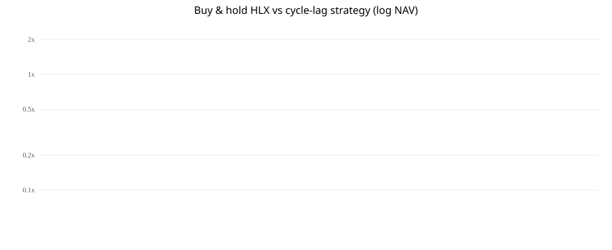
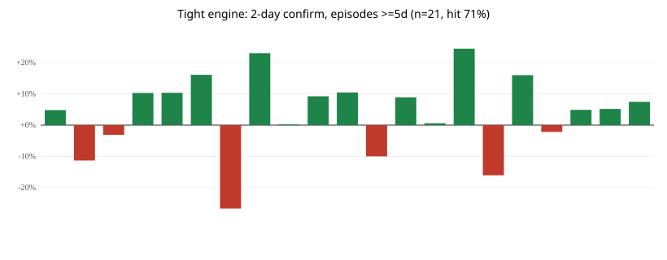

# helix-factor-screen

HLX tape ends **2026-09-01**. HOS is a different security. Do not splice.

**Status page:** [STATUS.md](STATUS.md) · **Thesis:** [thesis/THESIS.md](thesis/THESIS.md) · **Residual line:** [thesis/Residual_Catchup.md](thesis/Residual_Catchup.md) · **Lab:** [LAB.md](LAB.md)

한국어: [STATUS.ko.md](STATUS.ko.md) · [LAB.ko.md](LAB.ko.md) · [thesis/Residual_Catchup.ko.md](thesis/Residual_Catchup.ko.md)

## What shipped

Closed tape. Comovement measured. Three return engines written down. One risk sleeve that cuts vol. One filter for other people’s oil–equity notebooks.

Status page: [STATUS.md](STATUS.md) · [한국어](STATUS.ko.md)

**Wrap-up:** the picture below is the best book this repo ever printed. It is an **in-sample pattern**, not alpha. Live engine **KILL**. History book **PARK**.

## Main figure — year-end NAV

Strategy **2.06×** vs HLX buy-and-hold **0.69×** vs OSB **0.71×** (2012–2026-09-01, cash default, no splice).

That curve is why the idea looked real. Frozen-gate walk-forward 2020–2026-09-01 then lost to buy-and-hold (0.45× vs 1.10×). TP/SL/pyramid 4.19× is the same path after 2022 was already seen. Do not quote either number as out-of-sample.

## Trade blotter on that book

Tight engine: 2-day confirm, episodes ≥5d. **n=21, hit 71%.**

## Pattern, not forecast

Helix-type well-intervention names do not lead oil. They ride oil-service beta with a lag. When oil and OIH are already on, a 60-day lag versus OSB is a description. It is not a buy rule after costs and a frozen OOS cut.

## Links to check yourself

| what | url |
| --- | --- |
| This README (charts) | https://github.com/Liam-Son/helix-factor-screen |
| Thesis | https://github.com/Liam-Son/helix-factor-screen/blob/main/thesis/THESIS.md |
| NAV svg | https://github.com/Liam-Son/helix-factor-screen/blob/main/cycle_lag/bh_vs_strategy.svg |
| Trade bars | https://github.com/Liam-Son/helix-factor-screen/blob/main/cycle_lag/engine_trades_tight.svg |
| 21-trade blotter | https://github.com/Liam-Son/helix-factor-screen/blob/main/cycle_lag/SIGNALS.md |
| Results dump | https://github.com/Liam-Son/helix-factor-screen/blob/main/RESULTS.md |
| ls-crude 097 card | https://github.com/Noah-TaeHwan/ls-crude/blob/main/research/factors/097-helix-hos-cycle-lag/README.md |
| 097 figures | https://github.com/Noah-TaeHwan/ls-crude/tree/main/research/factors/097-helix-hos-cycle-lag/figures |
| Walk-forward FAIL | https://github.com/Noah-TaeHwan/ls-crude/blob/main/research/factors/097-helix-hos-cycle-lag/WALKFORWARD.md |
| Test inventory | https://github.com/Noah-TaeHwan/ls-crude/blob/main/research/factors/097-helix-hos-cycle-lag/TEST_INVENTORY.md |

## After the cycle-lag kill (102 / 103 / v22 / v23)

The 2.06× figure above is still the best *in-sample pattern* this repo drew. It is not the last experiment.

Peer-neutral residual catch-up was registered as 102. First-breach v19 opened holdout through 2026-04-21 and failed (DEV −0.60%, HOLD −0.25%). Pair books versus OII and other listed peers failed independently (103). Two development-only revisions — two-turn confirmation (v22) and a 10-session episode cap (v23) — raised the DEV mean to +2.65% then +3.85% and still missed ADVANCE (\(n<40\), neighbors 6/9). HOLD stays sealed.

Write-up: [thesis/Residual_Catchup.md](thesis/Residual_Catchup.md)

| card | one line | url |
| --- | --- | --- |
| 102 v19 | HOLD mean −0.25%, NOT_PROVEN | https://github.com/Noah-TaeHwan/ls-crude/blob/main/research/factors/102-helix-hir-alphalock/README.md |
| 103 pairs | HLX–OII residual half-life 0.2d | https://github.com/Noah-TaeHwan/ls-crude/blob/main/research/factors/103-helix-peer-pairs/README.md |
| v22 | two-turn DEV +2.65%, no ADVANCE | https://github.com/Noah-TaeHwan/ls-crude/blob/main/research/factors/102-helix-hir-alphalock/v22/README.md |
| v22-D | OSB=OII+FTI worse | https://github.com/Noah-TaeHwan/ls-crude/blob/main/research/factors/102-helix-hir-alphalock/v22/move-D-oii-fti/README.md |
| v23 | cap=10 DEV +3.85%, no ADVANCE | https://github.com/Noah-TaeHwan/ls-crude/blob/main/research/factors/102-helix-hir-alphalock/v23/README.md |

## Phase 1 close (2026-09-10)

Deck: https://github.com/Noah-TaeHwan/ls-crude/blob/main/research/presentations/ls-crude-phase1-wrapup.pptx

Homework (not yet testable): [099 MP1 daily](https://github.com/Noah-TaeHwan/ls-crude/blob/main/research/factors/099-fomc-mp1-daily-proxy/README.md) · [100 HOS n=5](https://github.com/Noah-TaeHwan/ls-crude/blob/main/research/factors/100-hos-regime-b/README.md) · [101 EIA n=8](https://github.com/Noah-TaeHwan/ls-crude/blob/main/research/factors/101-eia-inventory-consensus/README.md)
